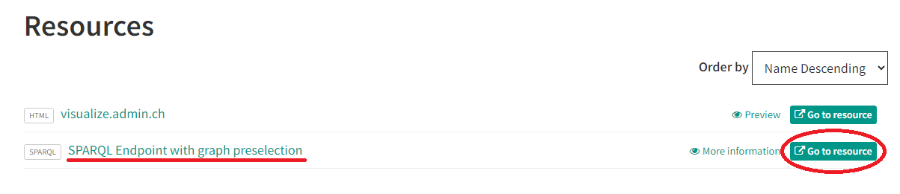

# LINDAS Replication

## Table of Contents

- [Requirements](#requirements)
- [Setup](#setup)
- [Working with Datasets](#working-with-datasets)
  - [Setting up the Electricity Price Dataset](#setting-up-the-electricity-price-dataset)
- [Triplestore Options](#triplestore-options)
  - [Option 1: Apache Jena Fuseki](#option-1-apache-jena-fuseki)
  - [Option 2: Virtuoso](#option-2-virtuoso)
- [Example SPARQL Queries](#example-sparql-queries)
  - [List Unique Dimensions](#list-unique-dimensions)
  - [Tariff Analysis](#tariff-analysis)

## Requirements

- Docker and Docker Compose
- cURL

## Setup

```bash
git clone https://github.com/master-thesis-ara/LINDAS-replication.git

cd LINDAS-replication

mkdir -p ./data
```

## Working with Datasets

### Downloading a Dataset

1. Create dataset directory:

   ```bash
   mkdir -p ./data/datasets
   ```

2. Go to [opendata.swiss](https://opendata.swiss/en/dataset/?linked_data=SPARQL). This link opens opendata.swiss search window with SPARQL as format preselected.

3. Select a dataset then got to the section "Resources" and under "SPARQL Endpoint with graph preselection", click on "Go to Resource":
   

4. Download a dataset by executing the SPARQL query:

   - Replace `<query>` with the query from the dataset page. **Important**: Make sure the query is in the correct format: `CONSTRUCT { ?s ?p ?o . } FROM <graph> WHERE { ?s ?p ?o . }`, not `SELECT * FROM <graph> WHERE { ?s ?p ?o . }`.
   - Replace `<dataset_name>` with the name of the dataset.

   ```bash
   curl -X POST \
     -H "Content-Type: application/sparql-query" \
     -H "Accept: text/turtle" \
     --data <query> \
     https://lindas.admin.ch/query > ./data/datasets/<dataset_name>.ttl
   ```

   **Examples:**

   - Electricity Price dataset (~3.5GB and ~20'000'000 triples):

     ```bash
      curl -X POST \
        -H "Content-Type: application/sparql-query" \
        -H "Accept: text/turtle" \
        --data "PREFIX rdf: <http://www.w3.org/1999/02/22-rdf-syntax-ns#>
          CONSTRUCT { ?s ?p ?o . }
          FROM <https://lindas.admin.ch/elcom/electricityprice>
          WHERE { ?s ?p ?o . }" \
        https://lindas.admin.ch/query > ./data/datasets/electricityprice.ttl
     ```

   - Electricity Price Per Canton dataset (~5KB and 61 triples):
     ```bash
       curl -X POST \
         -H "Content-Type: application/sparql-query" \
         -H "Accept: text/turtle" \
         --data "PREFIX schema: <http://schema.org/>
           CONSTRUCT {
             <https://energy.ld.admin.ch/elcom/electricityprice-canton> ?p ?o.
           }
           FROM <https://lindas.admin.ch/elcom/electricityprice>
           WHERE {
             <https://energy.ld.admin.ch/elcom/electricityprice-canton> ?p ?o.
           }" \
         https://lindas.admin.ch/query > ./data/datasets/electricityprice.ttl
     ```

## Triplestore Options

### Option 1: Apache Jena Fuseki

1. Load data:

   - Replace `<dataset_name>` with the name of the dataset.

   ```bash
   mkdir -p ./data/fuseki/databases

   docker run --rm -v "$(pwd):/tmp" stain/jena tdb2.tdbloader --loc /tmp/data/fuseki/databases/<dataset_name> /tmp/data/datasets/<dataset_name>.ttl
   ```

2. Updated the `infrastructure/docker-compose-fuseki.yaml` file by replacing `<dataset_name>` with the name of the dataset:

   ```yaml
   [...]

     fuseki:
       image: stain/jena-fuseki
       container_name: fuseki
       ports:
         - "3030:3030"
       environment:
         - ADMIN_PASSWORD=admin
         - JVM_ARGS=-Xmx2g
         - FUSEKI_DATASET_1=<dataset_name> # <dataset_name> = electricityprice
         - TDB=2

   [...]

     yasgui:
       image: erikap/yasgui
       container_name: yasgui
       ports:
         - "3000:80"
       environment:
         DEFAULT_SPARQL_ENDPOINT: "http://localhost:3030/<dataset_name>/sparql" # <dataset_name> = electricityprice

   [...]
   ```

3. Start services:

   ```bash
   docker compose -f ./infrastructure/docker-compose-fuseki.yaml up -d
   ```

Access points:

- YASGUI Query Interface: [http://localhost:3000](http://localhost:3000)
- Fuseki Admin: [http://localhost:3030/](http://localhost:3030/) (USER: `admin`, PASSWORD: `admin`)
- Graph Explorer: [http://localhost:80/explorer](http://localhost:80/explorer) (Endpoint: http://localhost:3030/<dataset_name>)

### Option 2: Virtuoso

1. Update the `infrastructure/docker-compose-virtuoso.yaml` file:

   - Replace `<dataset_name>` with the name of the dataset:

   ```yaml
   [...]

     virtuoso:
       image: openlink/virtuoso-opensource-7
       container_name: virtuoso
       environment:
         DBA_PASSWORD: admin
         DEFAULT_GRAPH: "http://example.org/<dataset_name>" # <dataset_name> = electricityprice
       ports:
         - "3030:8890"
         - "1111:1111"
       volumes:
         - ../data/virtuoso/virtuoso-db:/database
         - ../data/datasets:/usr/share/proj

   [...]
   ```

2. Start services:

```bash
docker compose -f ./infrastructure/docker-compose-virtuoso.yaml up -d
```

3. Load data:

```bash
docker exec -it virtuoso isql 1111 dba admin exec="DB.DBA.TTLP(file_to_string_output('/usr/share/proj/<dataset_name>.ttl'), '', 'http://example.org/<dataset_name>', 0); rdf_loader_run();"
```

Access point:

- Query Editor: [http://localhost:3030/sparql](http://localhost:3030/sparql)
- Virtuoso Conductor: [http://localhost:3030/conductor](http://localhost:3030/conductor) (USER: `dba`, PASSWORD: `admin`)

## Example SPARQL Queries (Electricity Price Dataset)

### List Unique Dimensions

```sparql
SELECT DISTINCT ?dimension WHERE {
  ?observation <https://cube.link/observation> ?obs .
  ?obs ?dimension ?value .
}
```

### Tariff Analysis

```sparql
# Canton Total Tariffs
SELECT ?canton ?total WHERE {
  ?observation <https://cube.link/observation> ?obs .
  ?obs <https://energy.ld.admin.ch/elcom/electricityprice/dimension/canton> ?canton .
  ?obs <https://energy.ld.admin.ch/elcom/electricityprice/dimension/total> ?total .
}

# Municipality Total Tariffs
SELECT ?municipality ?total WHERE {
  ?observation <https://cube.link/observation> ?obs .
  ?obs <https://energy.ld.admin.ch/elcom/electricityprice/dimension/municipality> ?municipality .
  ?obs <https://energy.ld.admin.ch/elcom/electricityprice/dimension/total> ?total .
}

# Canton Median Tariffs
SELECT ?canton (AVG(?total) AS ?median) WHERE {
  ?observation <https://cube.link/observation> ?obs .
  ?obs <https://energy.ld.admin.ch/elcom/electricityprice/dimension/canton> ?canton .
  ?obs <https://energy.ld.admin.ch/elcom/electricityprice/dimension/total> ?total .
}
GROUP BY ?canton
```
